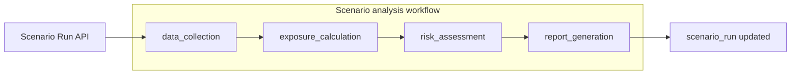

# PortfolioQ – Autonomous Workflow (LangGraph)

This document defines the **workflow architecture**, **state schema**, **nodes**, and **edges** for the scenario analysis pipeline. The workflow is implemented with LangGraph and orchestrates: data collection → exposure calculation → risk assessment → report generation.

---

## 1. High-level design

The scenario analysis workflow runs once per **scenario run** (one scenario + one or more portfolios). It is triggered by `POST /api/v1/scenarios/{scenario_id}/run` and can run synchronously or asynchronously via Celery.

- **Entry:** `data_collection`
- **Exit:** `report_generation` (writes final state and report ID to `scenario_run`)
- **Flow:** Linear; no conditional branching in the minimal version. Optional future: branch on validation or skip report if risk is below threshold.

---

## 2. State schema

Workflow state is a single shared object passed through every node. It is defined in code in `backend/src/workflows/state.py` and summarized below.

| Field | Type | Description |
|-------|------|-------------|
| `run_id` | `str` | Scenario run ID (from DB). |
| `scenario_id` | `str` | Scenario ID. |
| `portfolio_ids` | `list[str]` | Portfolio IDs to analyze. |
| `status` | `str` | `"pending"` \| `"running"` \| `"completed"` \| `"failed"`. |
| `current_node` | `str` \| `None` | Last executed node (for logging/debug). |
| `market_data` | `dict` \| `None` | Output of data_collection: normalized market/commodity data keyed by symbol or source. |
| `exposure_result` | `dict` \| `None` | Output of exposure_calculation: e.g. company/sector exposures, total exposure, aligned with `Exposure` schema. |
| `risk_result` | `dict` \| `None` | Output of risk_assessment: e.g. risk scores, P&amp;L impact, prioritization. |
| `report_id` | `str` \| `None` | After report_generation: stored report ID. |
| `error` | `str` \| `None` | If status is `"failed"`, error message. |
| `started_at` | `str` \| `None` | ISO datetime when run started. |
| `completed_at` | `str` \| `None` | ISO datetime when run finished. |

- **Inputs** (set at workflow start): `run_id`, `scenario_id`, `portfolio_ids`.
- **Outputs** (set by nodes): `market_data`, `exposure_result`, `risk_result`, `report_id`; `status`, `current_node`, `error`, `started_at`, `completed_at` updated along the way.

---

## 3. Nodes

### 3.1 `data_collection`

- **Role:** Gather all market/commodity data required for the given scenario and portfolios.
- **Input (from state):** `scenario_id`, `portfolio_ids`.
- **Actions:**
  - Resolve portfolio holdings (symbols, sectors, etc.).
  - Determine required data from scenario type and parameters (e.g. equities, commodities, rates).
  - Call market data service(s) / integrations (e.g. Alpha Vantage, Yahoo Finance, FRED); use cache where applicable.
  - Normalize to a common structure (e.g. time series or point-in-time).
- **Output (into state):** `market_data` (e.g. dict of symbol → time series or latest price), `current_node = "data_collection"`.
- **Errors:** On failure, set `status = "failed"`, `error = <message>`. Retries (see below) apply.

### 3.2 `exposure_calculation`

- **Role:** Compute portfolio exposure for the scenario using collected data.
- **Input (from state):** `scenario_id`, `portfolio_ids`, `market_data`.
- **Actions:**
  - Call exposure service: e.g. `calculate_exposure(portfolio_ids, scenario_id, market_data)`.
  - Receive company-level and sector-level exposure (and any factor exposure); align with `Exposure` schema.
- **Output (into state):** `exposure_result` (serializable dict matching exposure API shape), `current_node = "exposure_calculation"`.
- **Errors:** On failure, set `status = "failed"`, `error = <message>`.

### 3.3 `risk_assessment`

- **Role:** Compute risk scores and optional P&amp;L impact from exposure and scenario.
- **Input (from state):** `scenario_id`, `portfolio_ids`, `exposure_result`, optionally `market_data`.
- **Actions:**
  - Call risk service: e.g. risk scoring, prioritization, optional P&amp;L impact.
  - Produce a structure suitable for reports and alerts.
- **Output (into state):** `risk_result` (e.g. scores, rankings, impacts), `current_node = "risk_assessment"`.
- **Errors:** On failure, set `status = "failed"`, `error = <message>`.

### 3.4 `report_generation`

- **Role:** Generate the final report and persist it; update scenario run.
- **Input (from state):** `run_id`, `scenario_id`, `portfolio_ids`, `market_data`, `exposure_result`, `risk_result`.
- **Actions:**
  - Call report service: build report from run data (e.g. PDF/Excel); save to storage; create DB record.
  - Set `report_id` in state; set `status = "completed"`; set `completed_at`; persist state to `scenario_run` (e.g. results, report_id, status, completed_at).
- **Output (into state):** `report_id`, `status = "completed"`, `completed_at`, `current_node = "report_generation"`.
- **Errors:** On failure, set `status = "failed"`, `error = <message>`.

---

## 4. Edges

- **Start → data_collection:** Entry point when workflow is invoked.
- **data_collection → exposure_calculation:** Always (on success); on failure workflow stops and state is persisted as failed.
- **exposure_calculation → risk_assessment:** Always (on success).
- **risk_assessment → report_generation:** Always (on success).
- **report_generation → END:** Terminal node; no outgoing edge.

No conditional edges in the minimal design: each node runs once in order. Conditional logic (e.g. skip report, or retry path) can be added later via LangGraph conditional edges.

---

## 5. Error handling and retries

- **Per-node retries:** Each node should be wrapped with retry logic (e.g. tenacity): configurable max retries, backoff (e.g. exponential), and only then set `status = "failed"` and `error = <message>`.
- **State on failure:** When a node fails after retries, persist current state to `scenario_run` (status, error, current_node, any partial results) so runs are observable and debuggable.
- **No automatic retry of the whole workflow** in the minimal version; a new run can be triggered by the user/API.
- **Idempotency:** Nodes should avoid duplicate side effects when retried (e.g. report generation: create once and store `report_id`; do not create a second report on retry).

---

## 6. Integration points

| Component | Responsibility |
|-----------|----------------|
| **Scenario execution API** | Creates `scenario_run` record; invokes workflow with `run_id`, `scenario_id`, `portfolio_ids`; optionally runs workflow in Celery task for long runs. |
| **Market data service** | Fetches/normalizes market and commodity data; used by `data_collection`. |
| **Exposure service** | Computes exposure; used by `exposure_calculation`. |
| **Risk service** | Computes risk scores/impact; used by `risk_assessment`. |
| **Report service** | Generates PDF/Excel, stores file, creates report record; used by `report_generation`. |
| **Celery** | Optional: run the LangGraph workflow in a Celery task so the API returns immediately and status is polled via `scenario_run`. |

---

## 7. Observability

- **Logging:** Log at workflow start/end and at each node entry/exit (with `run_id`, `current_node`, duration).
- **LangSmith:** If `LANGSMITH_API_KEY` is set, LangGraph/LangSmith can trace runs (optional).
- **DB:** `scenario_run` stores status, error, results summary, report_id, started_at, completed_at so the API and UI can show run status and link to the report.

---

## 8. File and module layout (implemented)

- **`backend/src/workflows/state.py`** – State schema (`ScenarioAnalysisStateTypedDict`, `ScenarioAnalysisState` Pydantic model, `to_graph_state()`).
- **`backend/src/workflows/graph.py`** – LangGraph `StateGraph`: nodes, conditional edges (stop on `status="failed"`), `build_scenario_analysis_graph()`, `run_workflow(run_id, scenario_id, portfolio_ids)`. Per-node retries via tenacity (3 attempts, exponential backoff).
- **`backend/src/workflows/nodes/`** – `data_collection.py`, `exposure_calculation.py`, `risk_assessment.py`, `report_generation.py`. Each node returns a partial state update; stubs call placeholder logic until market data, exposure, risk, and report services are implemented.
- **`backend/src/api/v1/endpoints/scenarios.py`** – `POST /{scenario_id}/run` accepts optional body `{ "portfolio_ids": [] }`, generates `run_id`, invokes `run_workflow()`, returns `run_id`, `status`, `report_id`, `error`, `started_at`, `completed_at`.

Persistence of final state to a `scenario_run` table is not yet implemented; the API returns the final state directly.
