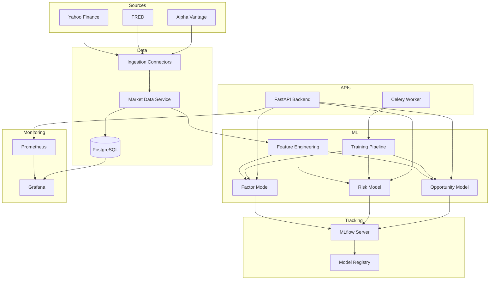
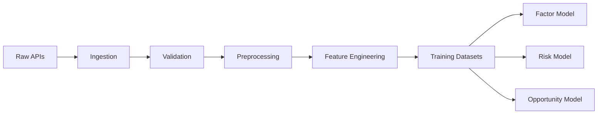
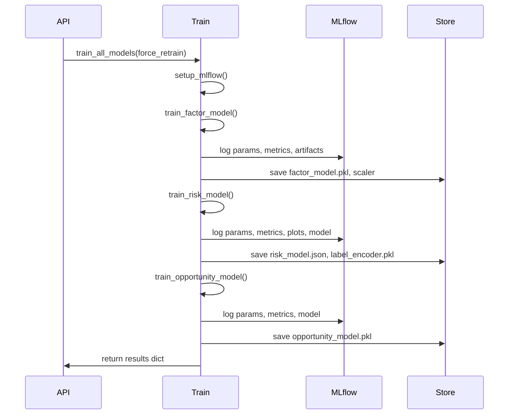
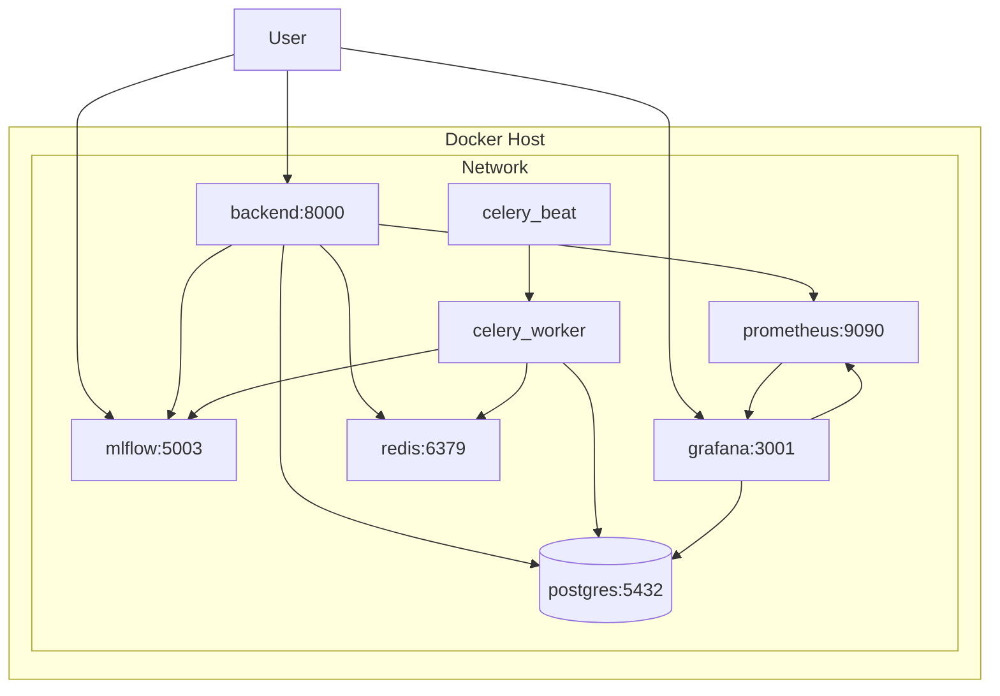
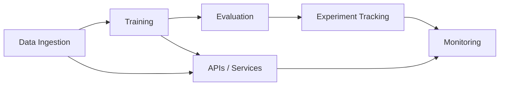

# PortfolioQ Machine Learning Platform — Technical Documentation

**Version:** 1.0  
**Audience:** Developers, Data Scientists, ML Engineers, Stakeholders  
**Purpose:** Complete technical reference for the ML system; suitable for Confluence publication.

---

## Section 1 — Project Overview

### 1.1 Business Objective

**PortfolioQ** is an **Autonomous Market & Portfolio Scenario Analyst** that enables enterprises to:

- Evaluate portfolio exposure to market events, commodity fluctuations, and regulatory changes
- Identify how scenarios affect individual holdings and sectors
- Detect emerging risks and strategic opportunities using machine learning
- Generate automated, board-ready scenario reports
- Track scenario triggers and provide real-time alerts
- Support portfolio sensitivity modeling, risk scoring, and scenario-based rebalancing recommendations

### 1.2 ML System Purpose

The machine learning platform within PortfolioQ serves to:

1. **Factor model:** Estimate per-symbol factor loadings (betas) for 8 macro factors to compute portfolio sensitivity and scenario P&L impact.
2. **Risk model:** Classify portfolio/holding risk into levels (low, medium, high, critical) from exposure and scenario features.
3. **Opportunity model:** Detect anomalous risk/return combinations and produce actionable signals (strong_buy, buy, hold, reduce, sell).

All models are tracked in MLflow, monitored via Prometheus/Grafana, and deployed through the FastAPI backend and Celery workers.

### 1.3 Problem Statement

- **Input:** Portfolios with holdings, scenario definitions, market/factor data.
- **Output:** Exposure metrics, risk scores, opportunity signals, scenario P&L, and reports.
- **Challenge:** Provide consistent, auditable, and reproducible ML-driven insights with full experiment tracking and operational monitoring.

### 1.4 High-Level Architecture Overview

| Layer | Components |
|-------|-------------|
| **Data** | Yahoo Finance, FRED, Alpha Vantage; PostgreSQL (app + MLflow) |
| **ML** | Factor (Ridge), Risk (XGBoost), Opportunity (Isolation Forest) |
| **Tracking** | MLflow (experiments, registry, artifacts) |
| **APIs** | FastAPI backend (port 8000); ML endpoints for status, train, retrain, score, tune |
| **Async** | Celery + Redis (training, scenarios, alerts, market data) |
| **Monitoring** | Prometheus (scrape backend `/metrics`), Grafana (dashboards) |

### 1.5 Expected Outcomes

- Reproducible training runs with logged parameters, metrics, and artifacts
- Centralized model registry with versioning and Production staging
- Operational visibility via Grafana (API, scenario, risk, ML metrics)
- Single-command training and retraining (pipeline + API)
- No Docker port changes; PostgreSQL used end-to-end (app + MLflow)

---

## Section 2 — System Architecture

### 2.1 System Components

| Component | Technology | Purpose |
|-----------|------------|---------|
| **Backend API** | FastAPI, Uvicorn | REST API, ML endpoints, Prometheus metrics |
| **PostgreSQL** | Postgres 15 | Application DB + MLflow backend store |
| **Redis** | Redis 7 | Celery broker and result backend |
| **MLflow** | MLflow 2.22 | Experiment tracking, model registry, artifacts |
| **Prometheus** | Prometheus | Scrapes backend `/metrics` |
| **Grafana** | Grafana | Dashboards (PostgreSQL + Prometheus) |
| **Celery Worker** | Celery 5 | Async training, scenarios, alerts, market data |
| **Celery Beat** | Celery Beat | Scheduled tasks (hourly prices, daily scenarios, weekly retrain) |

### 2.2 Data Flow Between Components

```
Data Sources (Yahoo/FRED/Alpha Vantage)
        │
        ▼
Ingestion / Market Data Service ──► PostgreSQL (market_data, prices)
        │
        ├──► Feature Engineering ──► Factor returns, equity returns, risk features
        │
        ▼
ML Training (Factor, Risk, Opportunity)
        │
        ├──► Model artifacts ──► MODEL_STORE (/app/ml_models)
        ├──► MLflow (params, metrics, artifacts, registry)
        ▼
Backend API (inference: score, factor-betas) ◄── Prometheus /metrics
        │
        ▼
Grafana (dashboards: PostgreSQL + Prometheus)
```

### 2.3 Architecture Diagram (Mermaid)



### 2.4 Integration Summary

- **Backend ↔ PostgreSQL:** All application and MLflow metadata (experiments, runs, registered models) stored in one PostgreSQL instance.
- **Backend ↔ MLflow:** `MLFLOW_TRACKING_URI=http://mlflow:5003`; training and API code log/load via MLflow client.
- **Backend ↔ Prometheus:** Backend exposes `/metrics`; Prometheus scrapes `backend:8000`.
- **Grafana ↔ Prometheus & PostgreSQL:** Provisioned datasources; dashboards query both for system and business metrics.

---

## Section 3 — Data Pipeline

### 3.1 Data Sources

| Source | Integration | Data |
|--------|-------------|------|
| **Yahoo Finance** | `src.integrations.yahoo_finance` | OHLCV prices, factor proxies (indices/ETFs), multiple symbols |
| **FRED** | `src.integrations.fred` | Macro indicators (rates, CPI, unemployment, Treasury, oil) |
| **Alpha Vantage** | `src.integrations.alpha_vantage` | Daily adjusted prices, sector performance (optional) |

### 3.2 Data Ingestion Process

- **Market prices:** `ingest_market_prices(db, symbols, period, persist)` — fetches via Yahoo Finance; optionally persists via `fetch_and_store_prices`.
- **Factor returns:** `ingest_factor_returns(period)` — returns a DataFrame of 8 factor returns (market, small_cap, value, momentum, oil, gold, bonds, usd).
- **Macro indicators:** `ingest_macro_indicators(start)` — FRED macro series.
- **Scenario-specific:** `ingest_portfolio_holdings_for_scenario(db, scenario, holdings)` — delegates to `collect_scenario_market_data` for workflow.

### 3.3 Preprocessing Pipeline

- **Factor model:** Common index alignment between factor returns and symbol returns; minimum 30 non-NaN observations per symbol; StandardScaler on factor returns.
- **Risk model:** Synthetic training data generator (or future real data); LabelEncoder for risk levels; StratifiedKFold for CV.
- **Opportunity model:** Feature matrix restricted to `OPPORTUNITY_FEATURES`; missing filled with 0; StandardScaler; minimum 2 samples to fit.

### 3.4 Feature Engineering Steps

- **Financial features** (`src.feature_engineering.financial_features`):
  - Volatility: rolling std, annualized vol
  - Rolling statistics: mean/std over configurable windows (5, 10, 20, 60)
  - Factor risk: per-factor volatility, mean absolute correlation
- **Risk model features:** `total_exposure_pct`, `market_beta`, `scenario_severity`, `sector_concentration`, `top_holding_weight`, `n_holdings`, `market_volatility`, `oil_exposure`, `bond_exposure`, `regulatory_factor`.
- **Opportunity features:** `risk_score`, `total_exposure_pct`, `market_beta`, `sector_concentration`, `pl_impact_pct`, `volatility`, `momentum_signal`, `value_signal`.

### 3.5 Data Validation

- **Schema** (`src.data_validation.schema`): `validate_price_schema` (required `close_price`); `validate_factor_schema` (required factor columns).
- **Clean** (`src.data_validation.clean`): `handle_missing`, `detect_outliers`, `clean_series`.
- **Drift** (`src.data_validation.drift`): `compute_psi`, `detect_data_drift` (used by monitoring and evaluation reliability).

### 3.6 Dataset Versioning

- MLflow tracks each training run with parameters (e.g. `n_training_samples`, `alpha`, `n_estimators`). Artifacts (plots, CSV, model files) are stored per run. Model Registry versions are immutable; dataset versioning can be extended by logging dataset URIs or hashes as run params/artifacts.

### 3.7 Data Flow Diagram (Mermaid)



---

## Section 4 — Machine Learning Model Selection

### 4.1 Factor Model (Ridge Regression)

| Aspect | Description |
|--------|-------------|
| **Model** | Ridge regression (one model per symbol). |
| **Reason** | Linear, interpretable factor loadings (betas); L2 regularization avoids overfitting with limited history. |
| **Advantages** | Fast, stable, explainable; sector default betas for unseen symbols. |
| **Limitations** | Linear only; assumes factor returns drive equity returns linearly. |

### 4.2 Risk Model (XGBoost Classifier)

| Aspect | Description |
|--------|-------------|
| **Model** | XGBoost multiclass classifier (risk_level: low/medium/high/critical). |
| **Reason** | Handles mixed feature types and non-linear boundaries; strong performance with limited data; feature importance for explainability. |
| **Advantages** | Accuracy, CV-based validation, Optuna tuning optional. |
| **Limitations** | Requires sufficient labeled data (synthetic used when real labels unavailable). |

### 4.3 Opportunity Model (Isolation Forest)

| Aspect | Description |
|--------|-------------|
| **Model** | Isolation Forest (unsupervised anomaly detection). |
| **Reason** | No labels needed; flags unusual risk/return combinations as opportunities or risks. |
| **Advantages** | Works with unlabeled data; fast; interpretable anomaly scores. |
| **Limitations** | Contamination and threshold choices affect signal rate; post-processing rules map scores to strong_buy/buy/hold/reduce/sell. |

### 4.4 Model Comparison and Selection

- **Factor:** Ridge chosen over plain OLS for stability; over tree models for interpretability of betas.
- **Risk:** XGBoost chosen over logistic regression for non-linearity; over deep learning for data size and ops simplicity.
- **Opportunity:** Isolation Forest chosen over one-class SVM for speed and scalability; rule layer on top for business signals.

---

## Section 5 — Model Architecture

### 5.1 Factor Model

- **Inputs:** Factor returns matrix (T×8): market, small_cap, value, momentum, oil, gold, bonds, usd; symbol returns (T×N).
- **Transformations:** StandardScaler on factor returns; per-symbol Ridge fit on scaled factors → symbol return.
- **Structure:** One Ridge(alpha=0.1) per symbol; shared scaler; sector default betas when symbol not in training set.
- **Outputs:** Per-symbol factor betas; scenario_pl_impact; portfolio_sensitivity (aggregate betas, P&L).

### 5.2 Risk Model

- **Inputs:** Feature vector of 10 floats (total_exposure_pct, market_beta, scenario_severity, sector_concentration, top_holding_weight, n_holdings, market_volatility, oil_exposure, bond_exposure, regulatory_factor).
- **Transformations:** LabelEncoder for risk_level (low/medium/high/critical); no scaling (tree-based).
- **Structure:** XGBClassifier(max_depth=5, learning_rate=0.05, n_estimators=200, subsample=0.8, colsample_bytree=0.8, reg_alpha=0.1, reg_lambda=1.0).
- **Outputs:** risk_score (0–1), risk_level, class probabilities.

### 5.3 Opportunity Model

- **Inputs:** 8 features: risk_score, total_exposure_pct, market_beta, sector_concentration, pl_impact_pct, volatility, momentum_signal, value_signal.
- **Transformations:** StandardScaler; missing/extra columns normalized to fixed feature set.
- **Structure:** IsolationForest(n_estimators=200, contamination=0.1); rule-based mapping of anomaly score + risk/pl to signal.
- **Outputs:** opportunity_score (0–1), signal (strong_buy/buy/hold/reduce/sell), raw anomaly score.

### 5.4 Model Architecture Diagram (Conceptual)

```
Factor:   [Factor Returns T×8] → StandardScaler → [Ridge per symbol] → Betas, P&L
Risk:     [Feature vector 1×10] → XGBClassifier → [probabilities] → risk_score, risk_level
Opportunity: [Feature vector 1×8] → StandardScaler → IsolationForest → score + rules → signal
```

---

## Section 6 — Training Pipeline

### 6.1 Workflow Steps

1. **Setup:** `setup_mlflow()` sets tracking URI and creates experiments (if missing).
2. **Dataset loading:**
   - Factor: `fetch_factor_returns`, `fetch_multiple_symbols` (or synthetic); align and compute returns.
   - Risk: `generate_training_data(n_samples=3000)` (synthetic) or future real labels.
   - Opportunity: synthetic portfolio features or scenario-driven features; `_prepare_features`.
3. **Feature preparation:** Per-model (see Section 5); scalers fit on training data.
4. **Model training:** `factor_model.fit()`, `model.fit(X, y)` (risk), `model.fit(X)` (opportunity).
5. **Validation:** Risk uses StratifiedKFold CV; factor/opportunity log in-run metrics.
6. **Artifact generation:** Plots (R2 bar, feature importance, confusion matrix, anomaly histogram), CSV, classification report, run summary JSON; models and scalers logged to MLflow.

### 6.2 Execution Entry Points

- **API:** `POST /api/v1/ml/train` (initial train), `POST /api/v1/ml/retrain` (force retrain all).
- **Script:** `python pipelines/training_pipeline.py` (from backend root); env `FORCE_RETRAIN=true|false`.
- **Celery:** Weekly `retrain_all_models` (beat schedule).

### 6.3 Training Pipeline Flow Diagram (Mermaid)



---

## Section 7 — Hyperparameter Tuning

### 7.1 Tuning Strategy

- **Factor model:** Fixed Ridge `alpha=0.1` (configurable); no automated tuning in pipeline.
- **Risk model:** Optuna-based tuning via `tune_risk_model(n_trials=30)`; exposed as `POST /api/v1/ml/tune`. Search over XGBoost hyperparameters (e.g. max_depth, learning_rate, n_estimators, reg_alpha, reg_lambda).
- **Opportunity model:** Fixed Isolation Forest `contamination=0.1`, `n_estimators=200`; align with `configs/model_params.yaml`.

### 7.2 Parameter Search

- **Risk (Optuna):** Maximizes cross-validated accuracy; StratifiedKFold; timeout 600s.
- **Config file:** `configs/model_params.yaml` defines default hyperparameters for factor (ridge, scaler), risk (xgboost, cv, tuning_optuna), opportunity (isolation_forest).

### 7.3 Key Hyperparameters

| Model | Parameter | Default | Impact |
|-------|-----------|---------|--------|
| Factor | alpha | 0.1 | Higher → more regularization, smaller betas |
| Risk | max_depth | 5 | Tree depth; higher can overfit |
| Risk | learning_rate | 0.05 | Step size; lower often better with more trees |
| Risk | n_estimators | 200 | Number of trees |
| Risk | reg_alpha, reg_lambda | 0.1, 1.0 | L1/L2 regularization |
| Opportunity | n_estimators | 200 | Number of trees in Isolation Forest |
| Opportunity | contamination | 0.1 | Expected fraction of anomalies |

---

## Section 8 — Model Parameters and Weights

### 8.1 Factor Model

- **Trained parameters:** Per-symbol Ridge coefficients (betas); scaler mean_ and scale_; alpha.
- **Feature importance:** Not applicable (linear coefficients are the betas; magnitude and sign interpretable).
- **Persistence:** `factor_model.pkl` (models dict, scaler, alpha); `factor_scaler.pkl` (scaler only for registry).

### 8.2 Risk Model

- **Trained parameters:** XGBoost tree structures and leaf weights; LabelEncoder classes_.
- **Feature importance:** Logged per run as metrics and bar chart artifact; `model.clf.feature_importances_`.
- **Persistence:** `risk_model.json` (XGBoost native), `risk_label_encoder.pkl`.

### 8.3 Opportunity Model

- **Trained parameters:** Isolation Forest trees; scaler mean_ and scale_; contamination, n_estimators.
- **Feature importance:** Anomaly score is global; no per-feature importance in standard IF.
- **Persistence:** `opportunity_model.pkl` (model, scaler, contamination, n_estimators).

---

## Section 9 — Model Variance and Bias Analysis

### 9.1 Bias vs Variance

- **Factor:** Ridge reduces variance (regularization); bias from linearity assumption.
- **Risk:** Stratified CV (e.g. 5-fold) gives mean/std accuracy; train vs CV gap indicates overfitting.
- **Opportunity:** Unsupervised; no direct bias/variance split; contamination controls “positive” anomaly rate.

### 9.2 Overfitting Detection

- **Evaluation module** (`src.evaluation.reliability`): `check_overfitting_ratio(train_metric, val_metric, threshold=1.5)` flags when train metric is much better than validation.
- **Risk:** Cross-validation accuracy and train accuracy logged; large gap suggests overfitting.
- **Mitigation:** Regularization (Ridge alpha, XGBoost reg_alpha/reg_lambda), limiting tree depth, early stopping (if enabled).

### 9.3 Underfitting Detection

- Low train and validation metrics (e.g. low R2 for factor, low accuracy for risk) suggest underfitting; addressed by model capacity or feature set, not by current doc.

### 9.4 Validation Techniques

- **Factor:** In-run R2 and RMSE per symbol; no formal holdout in default pipeline.
- **Risk:** StratifiedKFold(n_splits=5); classification_report and confusion matrix on training set (for artifact); CV metrics in MLflow.
- **Drift:** `check_train_test_drift` (PSI) and `flag_unstable_predictions` in evaluation.reliability.

---

## Section 10 — Model Evaluation Metrics

### 10.1 Regression / Forecasting (Factor Model)

| Metric | Formula / Meaning | Use |
|--------|-------------------|-----|
| **R²** | 1 - SS_res/SS_tot | Proportion of variance explained; per symbol and average. |
| **RMSE** | √(mean((y_true - y_pred)²)) | Scale-dependent error magnitude. |
| **MSE** | mean((y_true - y_pred)²) | Used internally; RMSE reported. |
| **MAE** | mean(\|y_true - y_pred\|) | In evaluation.metrics.forecasting_metrics. |
| **MAPE** | mean(\|y_true - y_pred\|/\|y_true\|)*100 | Percentage error (evaluation.metrics). |

### 10.2 Classification (Risk Model)

| Metric | Meaning | Use |
|--------|---------|-----|
| **Accuracy** | Correct predictions / total | Logged as train_accuracy, cv_mean_accuracy. |
| **Precision** | TP / (TP + FP) per class | In classification_report artifact. |
| **Recall** | TP / (TP + FN) per class | In classification_report artifact. |
| **F1 (weighted)** | Harmonic mean of precision and recall, weighted by support | evaluation.metrics.classification_metrics. |
| **ROC-AUC** | Area under ROC (multiclass ovr) | classification_metrics when y_proba provided. |

### 10.3 Risk / Tail (Evaluation Module)

| Metric | Meaning | Use |
|--------|---------|-----|
| **VaR error** | \|model VaR - empirical VaR\| | risk_metrics_var_es. |
| **Expected Shortfall error** | \|model ES - empirical ES\| | risk_metrics_var_es. |

### 10.4 Opportunity Model

- **Anomaly score:** Isolation Forest score_samples (logged as mean_anomaly_score, std_anomaly_score, anomaly_fraction in training).
- **Signals:** strong_buy, buy, hold, reduce, sell (derived from score + risk_score and pl_impact_pct rules).

### 10.5 Metric Visualization

- **MLflow artifacts:** Factor R2 bar chart; risk feature importance bar chart; confusion matrix; opportunity anomaly histogram; run summary JSON (performance + system).
- **Grafana:** ML predictions rate and inference latency (Prometheus); risk scores and reports from PostgreSQL.

---

## Section 11 — MLflow Implementation

### 11.1 Experiment Tracking

- **Experiments:** `portfolioq_factor_model`, `portfolioq_risk_scoring`, `portfolioq_opportunity_detection`.
- **Runs:** One run per training invocation; run_name and tags (e.g. model_type, framework) set per model.

### 11.2 Parameter Logging

- Factor: alpha, n_factors, equity_universe_size.
- Risk: all XGBoost params, n_training_samples.
- Opportunity: contamination, n_estimators, n_samples.

### 11.3 Metric Logging

- **Performance:** training_duration_seconds, avg_r2, avg_rmse, n_models_trained (factor); train_accuracy, cv_mean_accuracy, cv_std_accuracy (risk); mean_anomaly_score, std_anomaly_score, anomaly_fraction (opportunity).
- **System:** system_cpu_percent, system_memory_used_gb, system_memory_percent (via log_system_metrics and log_run_summary).

### 11.4 Artifact Storage

- **Plots:** factor_r2_per_symbol.png, factor_metrics_per_symbol.csv; feature_importance.png; confusion_matrix.png; anomaly score histogram.
- **Evaluation:** classification_report.txt, mlflow_run_summary.json.
- **Models:** factor_scaler (sklearn); risk_clf (xgboost); opportunity detector (sklearn); all with signature and input_example where supported.

### 11.5 Model Versioning and Registry

- **Registered models:** `portfolioq_factor_scaler`, `portfolioq_risk_model`, `portfolioq_opportunity_model`.
- **Staging:** After each training run, latest version transitioned to Production; optional description set.
- **Loading:** `load_registered_model(name, stage="Production")` in mlflow_tracker (e.g. for deployment from registry).

### 11.6 Integration with Training Pipelines

- Each model’s train_* function uses `run_context(experiment_name, run_name, tags)` and logs params, metrics, artifacts, and registers/transitions the model within the same run.

---

## Section 12 — How to Start MLflow

### 12.1 Start MLflow Server

**Using Docker Compose (recommended):**

```bash
# From repository root (portfolioq)
docker compose up -d postgres mlflow
```

Or use the script:

```bash
bash scripts/start_mlflow.sh
```

MLflow server runs on **port 5003**; backend store and artifacts use PostgreSQL and mounted volume.

### 12.2 Access MLflow UI

- **URL:** http://localhost:5003  
- **Experiments:** http://localhost:5003/#/experiments  
- **Models:** http://localhost:5003/#/models  

No login required in default setup.

### 12.3 Run Experiment Tracking

- Training is tracked automatically when triggered via API (`POST /api/v1/ml/train` or `POST /api/v1/ml/retrain`) or when running `python pipelines/training_pipeline.py` (with backend and MLflow running).
- Ensure `MLFLOW_TRACKING_URI=http://mlflow:5003` in backend/celery env (already set in docker-compose).

### 12.4 Inspect Experiments and Models

- **Experiments tab:** Select experiment → view runs, compare params/metrics, open artifacts.
- **Models tab:** Select registered model → view versions, stage (Production/Staging), artifact path, load model URI for deployment.

---

## Section 13 — Grafana Monitoring Implementation

### 13.1 Metrics Tracked

- **Prometheus (backend /metrics):** API request count and duration, scenario runs and duration, portfolio risk score and P&L impact, alerts (created, unread), portfolios/holdings counts, reports generated, ML predictions count and inference duration, market data fetch count and duration.
- **PostgreSQL (Grafana datasource):** Portfolios, holdings, alerts, scenario_runs, reports, risk_scores, exposures (for tables and aggregations).

### 13.2 How Metrics Are Collected

- Backend instruments code with Prometheus counters/histograms/gauges (`src.analytics.metrics`); `/metrics` endpoint returns Prometheus text format.
- Prometheus scrapes `backend:8000/metrics` every 15s (config in `monitoring/prometheus/prometheus.yml`).
- Grafana is provisioned with Prometheus and PostgreSQL datasources; dashboard JSON in `monitoring/grafana/provisioning/dashboards/portfolioq.json`.

### 13.3 Dashboards

- **PortfolioQ — Enterprise Risk & Analytics:** Single main dashboard with stat panels (portfolios, holdings, alerts, scenario runs, reports), portfolio risk scores table, alert severity and scenario status pie charts, API request rate and latency, latest alerts table, sector exposure summary, scenario runs over time, ML predictions rate and inference latency p95, top holdings at risk.

---

## Section 14 — Grafana Dashboard Metrics

| Panel | Type | Datasource | Description |
|-------|------|------------|-------------|
| Total Portfolios | Stat | PostgreSQL | COUNT(*) FROM portfolios |
| Total Holdings | Stat | PostgreSQL | COUNT(*) FROM holdings |
| Unread Alerts | Stat | PostgreSQL | COUNT(*) WHERE read = false |
| Critical Alerts | Stat | PostgreSQL | COUNT(*) WHERE severity = 'critical' AND read = false |
| Scenario Runs (24h) | Stat | PostgreSQL | COUNT(*) FROM scenario_runs WHERE created_at > NOW() - 24h |
| Reports Generated | Stat | PostgreSQL | COUNT(*) FROM reports |
| Portfolio Risk Scores — Latest | Table | PostgreSQL | Latest risk_scores per portfolio with score, pl_impact, assessed_at |
| Alert Severity Distribution | Pie | PostgreSQL | Alerts by severity |
| Scenario Runs by Status | Pie | PostgreSQL | scenario_runs by status |
| API Request Rate (req/s) | Time series | Prometheus | rate(portfolioq_api_requests_total[1m]) by endpoint |
| API Response Time p95 (s) | Time series | Prometheus | histogram_quantile(0.95, ... portfolioq_api_request_duration_seconds_bucket) |
| Latest Alerts — Risk & Exposure | Table | PostgreSQL | Last 20 alerts with severity, title, message, portfolio, read, created_at |
| Sector Exposure Summary | Table | PostgreSQL | Latest exposures with risk_score, total_exposure |
| Scenario Runs Over Time | Time series | PostgreSQL | Count of scenario_runs by hour (7 days) |
| ML Model Predictions Per Minute | Time series | Prometheus | rate(portfolioq_ml_predictions_total[1m]) by model_name |
| ML Inference Latency p95 (s) | Time series | Prometheus | histogram_quantile(0.95, ... portfolioq_ml_inference_duration_seconds_bucket) by model_name |
| Top Holdings at Risk | Table | PostgreSQL | Top 20 holdings by market value with portfolio, symbol, sector, price |

---

## Section 15 — How to Start Grafana

### 15.1 Start Monitoring Services

```bash
# From repository root (portfolioq)
docker compose up -d prometheus grafana
# Or full stack
docker compose up -d
```

- **Prometheus:** http://localhost:9090  
- **Grafana:** http://localhost:3001 (mapped from container 3000)

### 15.2 Access Dashboards

- **Login:** User `${GRAFANA_USER:-admin}`, password `${GRAFANA_PASSWORD:-portfolioq_admin}` (see `.env` or `scripts/show-services.sh`).
- **Dashboard:** Provisioned "PortfolioQ — Enterprise Risk & Analytics" (uid: portfolioq-main); refresh 1m.

### 15.3 Troubleshooting Dashboard Issues

- **No data:** Ensure backend and Prometheus are up; Prometheus targets (backend:8000) healthy; Grafana datasource URLs point to `prometheus:9090` and PostgreSQL (host: postgres, port 5432, credentials from env).
- **PostgreSQL connection failed:** Set `POSTGRES_PASSWORD` in `.env` and match it in `monitoring/grafana/provisioning/datasources/datasources.yml` if edited.
- **Missing panels:** Confirm `monitoring/grafana/provisioning/dashboards/portfolioq.json` is loaded (dashboards.yml references it).

---

## Section 16 — Project Scripts

| Script | Purpose | How to Run |
|--------|---------|------------|
| **show-services.sh** | Print Grafana, Backend, MLflow, Prometheus, DB URLs and credentials | `bash scripts/show-services.sh` |
| **start_mlflow.sh** | Start PostgreSQL + MLflow containers | `bash scripts/start_mlflow.sh` |
| **validate-all-apis.sh** | Hit portfolios, scenarios, exposure, reports, alerts, ML endpoints | `bash scripts/validate-all-apis.sh [BASE_URL]` |
| **check-ml-models.sh** | Validate /ml/status, /ml/score, /ml/factor-betas, train/retrain/tune | `bash scripts/check-ml-models.sh` |
| **validate-ml-models-e2e.sh** | ML APIs + one scenario run + report validation | `bash scripts/validate-ml-models-e2e.sh` |
| **validate-system-e2e.sh** | 18-step full system validation (structure, deps, config, pipelines, MLflow, APIs, monitoring, alerts, etc.) | `bash scripts/validate-system-e2e.sh` |
| **run-all.sh** | Runs show-services, validate-all-apis, check-ml-models, validate-ml-models-e2e | `bash scripts/run-all.sh [BASE_URL]` |
| **train-ml-models.sh** | Trigger ML training (typically via API or pipeline) | See script for exact command |
| **retrain-ml-models.sh** | Trigger full retrain (e.g. curl POST /api/v1/ml/retrain) | See script |
| **test-ml-models.sh** | Test ML endpoints | See script |
| **register_model.py** | Optional helper to register/load models with MLflow | `python scripts/register_model.py` (from backend if applicable) |

**Training pipeline (Python):**

```bash
cd backend
python pipelines/training_pipeline.py
# FORCE_RETRAIN=true python pipelines/training_pipeline.py
```

**Import verification:**

```bash
docker compose exec backend python scripts/verify_imports.py
```

---

## Section 17 — Deployment Architecture

### 17.1 Docker Services

| Service | Image / Build | Port(s) | Role |
|---------|----------------|---------|------|
| postgres | postgres:15 | 5432 | Database (app + MLflow) |
| redis | redis:7-alpine | 6379 | Celery broker/backend |
| mlflow | ghcr.io/mlflow/mlflow:v2.22.0 | 5003 | MLflow server |
| prometheus | prom/prometheus | 9090 | Metrics scraping |
| grafana | grafana/grafana | 3001→3000 | Dashboards |
| backend | build: ./backend | 8000 | FastAPI app |
| celery_worker | build: ./backend | — | Async tasks |
| celery_beat | build: ./backend | — | Scheduler |

### 17.2 Deployment Diagram (Mermaid)



### 17.3 Model APIs

- **REST:** `GET /api/v1/ml/status`, `POST /api/v1/ml/score`, `POST /api/v1/ml/factor-betas`, `GET /api/v1/ml/mlflow-url`, `POST /api/v1/ml/train`, `POST /api/v1/ml/retrain`, `POST /api/v1/ml/tune`.
- Models loaded from disk (MODEL_STORE) on first use or after training; optional future use of MLflow Model Registry for loading Production version.

---

## Section 18 — System Workflow

### 18.1 End-to-End Flow

```
Data ingestion (Yahoo/FRED/optional Alpha Vantage)
    → Market data service / ingestion connectors
    → PostgreSQL (prices, market_data)
    → Feature engineering (factor returns, risk/opportunity features)
    → ML training (factor, risk, opportunity)
    → Model persistence (MODEL_STORE) + MLflow (experiments, registry, artifacts)
    → API inference (score, factor-betas) + scenario workflow (exposure, risk, report)
    → Prometheus metrics (/metrics)
    → Grafana dashboards (PostgreSQL + Prometheus)
```

### 18.2 Workflow Diagram (Mermaid)



---

## Section 19 — Troubleshooting Guide

| Issue | Possible cause | Solution |
|-------|----------------|----------|
| **MLflow not starting** | PostgreSQL not ready; missing psycopg2 in image | Wait for postgres health; image installs psycopg2-binary at startup. Check logs: `docker compose logs mlflow`. |
| **Grafana dashboard not loading** | Wrong datasource; PostgreSQL password mismatch | Verify provisioning/datasources/datasources.yml; align POSTGRES_PASSWORD with .env. |
| **Model training errors** | Missing data; import errors; MLflow unreachable | Run with real or synthetic data; ensure MLFLOW_TRACKING_URI and network to mlflow:5003; check backend/celery logs. |
| **Dependency issues** | Wrong Python or missing packages | Use backend container or venv with `pip install -r backend/requirements.txt`. For IDE “unresolved” imports, use backend pyrightconfig or select correct interpreter. |
| **No metrics in Grafana** | Prometheus not scraping backend | Ensure backend is up and Prometheus targets (backend:8000) are up; check prometheus.yml and network. |
| **Database connection refused** | Wrong host/port in containers | Use service names (postgres, redis) and correct DATABASE_URL in .env; no localhost for inter-container calls. |

---

## Section 20 — Future Improvements

- **Model retraining automation:** Stronger scheduling (e.g. Celery beat cron) and triggers (e.g. data freshness, drift).
- **Drift detection:** Automated PSI/model drift checks and alerts; re-train or flag when drift exceeds threshold.
- **Advanced monitoring:** Custom MLflow metrics in Grafana; alerting on model performance degradation or inference latency.
- **Scalable deployment:** Kubernetes or ECS for backend and workers; distributed training for large factor universes; model serving via MLflow or dedicated serving layer.
- **Dataset versioning:** Log dataset URI/hash in MLflow runs; integrate with DVC or similar for reproducible datasets.
- **A/B testing:** Serve multiple model versions and compare business metrics in Grafana.

---

## Document Control

| Version | Date | Author | Changes |
|---------|------|--------|---------|
| 1.0 | 2025 | PortfolioQ Team | Initial full technical documentation for Confluence. |

---

*This document is the single source of truth for the PortfolioQ ML platform. For runbooks and validation details, see PROJECT_DOCUMENTATION.md and scripts/validate-system-e2e.sh.*
